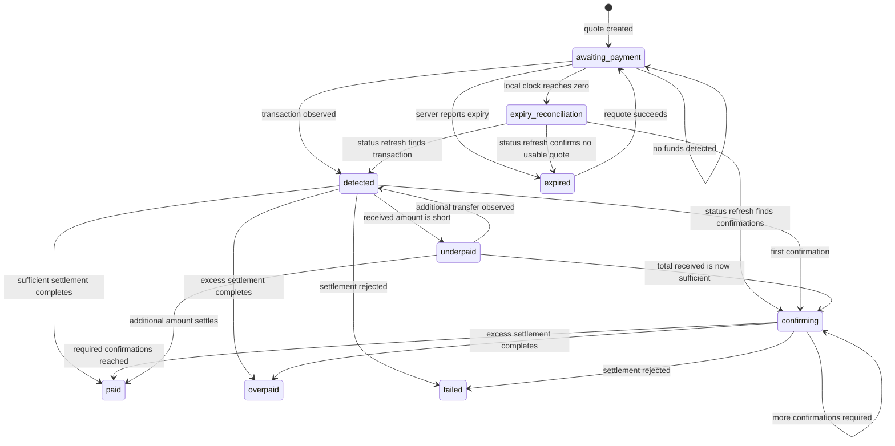

# Payment Lifecycle Semantics

Status: Implemented and release-verified
Scope: Payment lifecycle authority, transitions, polling, and shopper actions

## Authoritative state

The payment status returned by `GET /api/payments/:reference` is the
authoritative lifecycle state. The client may derive presentation modes from
that status, but it must not maintain a second independent payment state machine
that can contradict the server.

The client has no authoritative signal for QR scanning, address copying, wallet
interaction, or transaction broadcast. The first contractually defined evidence
that a transfer exists is the backend returning `detected`.

Quote expiration is a time-based client observation, not a replacement for the
server payment status. This distinction matters when detection and expiration
happen close together.

## Documented statuses

The brief provides eight statuses:

| Status | Shopper meaning | Implemented action class | Implemented polling behavior | Quote expiration behavior |
| --- | --- | --- | --- | --- |
| `awaiting_payment` | No transfer has been detected. | Shopper must send funds. | Continue. | Active. |
| `detected` | Transfer detected with zero confirmations. | Wait; do not send again. | Continue. | Frozen/irrelevant. |
| `confirming` | Transfer is accumulating confirmations. | Wait; do not send again. | Continue. | Frozen/irrelevant. |
| `paid` | Required payment settled successfully. | No action. | Stop. | Irrelevant. |
| `underpaid` | Some funds arrived, but less than required. | Send only the outstanding amount. | Continue. | Frozen/irrelevant. |
| `overpaid` | More than the requested amount settled. | Do not send more; retain reference/contact support. | Stop. | Irrelevant. |
| `expired` | The current quote can no longer be used. | Request a new quote. | Stop until requote. | Expired. |
| `failed` | Settlement was rejected. | Do not retry blindly; contact support. | Stop. | Irrelevant. |

The brief says there are "six more states" after naming four, but its API
fixtures document only four additional states, for eight total. The solution
should implement the eight contractually defined states and record the mismatch
as a brief ambiguity rather than inventing two states.

## Implemented transition model

Transitions not demonstrated by the supplied contract remain mock/testing
assumptions and must not be described as production API guarantees.

## Expiration reconciliation

### Problem

The local countdown can reach zero just after a blockchain transaction was
detected but before the next poll returns. Immediately replacing the payment
instructions with an expired screen could violate the explicit rule that a
payment already on its way must never expire under the shopper.

### Implemented policy

When the countdown reaches zero while the last authoritative state is
`awaiting_payment`:

1. Stop presenting the quote as safely payable.
2. Trigger one immediate payment-status refresh.
3. Show a brief neutral reconciliation state rather than a terminal expiry.
4. If the server reports `detected`, `confirming`, `underpaid`, `paid`, or
   `overpaid`, present that state and freeze expiry.
5. If the server reports `expired`, present expiry and enable requote.
6. If it still reports `awaiting_payment`, the client may present local expiry
   and enable requote, subject to the API's requote response.
7. If the refresh fails, show a connectivity warning and do not claim that the
   payment expired as an authoritative fact.

This accepted design decision is the design document's "one thing I would
defend" and is covered at hook and browser-race layers.

## Requote semantics

Explicit contract behavior:

- `POST /api/payments/:reference/requote` returns the same payment reference.
- It returns a new quote.
- Status returns to `awaiting_payment`.
- Calling it before expiry may return HTTP 409 with
  `application/problem+json`.

Required client consequences:

- Replace all quote-dependent fields atomically.
- Reset the countdown from the new `expires_at` value.
- Do not append a second payment record.
- Present the 409 detail as a recoverable quote conflict, then refresh the
  current authoritative payment rather than reporting a generic failure.

Mock/API safety policy: requote is accepted only when the authoritative state
is `expired`, or while it remains `awaiting_payment` after the absolute quote
deadline. A state proving funds arrived, a settled state, or `failed` cannot be
requoted merely because wall-clock time passed. The shopper UI should never
offer that action in those states, and the mock rejects direct unsafe calls.

## Payment-method commitment

The assessment requires a new quote when the shopper changes currency or
network, but leaving editable selectors beside active payment instructions can
create a dangerous mismatch. A shopper may begin an external transfer before
the backend detects it.

Implemented interaction:

1. The shopper chooses currency and network.
2. Quote creation succeeds.
3. The issued currency/network are rendered as fixed quote attributes, not
   ordinary live selectors.
4. While the authoritative status remains `awaiting_payment`, a secondary
   "Change payment method" action is available.
5. Activating it immediately hides the old instructions and returns to method
   selection without an intermediate confirmation dialog.
6. Choosing another method requests and commits a complete new quote rather
   than mutating fields from the previous quote.
7. At `detected` or any later state proving funds arrived, the change action is
   removed completely.

Copying the address and scanning the QR code do not change lifecycle state and
must not lock the method. Both actions only expose or transport instructions;
the provided API has no QR-read or transaction-broadcast event.

## Transport state versus payment state

Transport failures are orthogonal to payment status.

Examples:

- A 500 response does not mean `failed`.
- An offline browser does not mean `expired`.
- A slow poll does not mean the transfer was not detected.
- A quote-creation failure must not erase the last internally consistent quote
  unless it is no longer safe to use.

The interface should preserve the last known authoritative payment status,
communicate degraded connectivity, and retry according to a bounded policy.

## Polling invariants

1. At most one status request for a payment reference is in flight.
2. The next scheduled poll begins only after the current request settles.
3. Polling stops when the state is terminal.
4. Polling stops when the component unmounts or the active reference changes.
5. Abort/cancellation is not shown as a shopper-facing error.
6. A slower response for an obsolete reference or selection cannot overwrite
   the current payment.
7. Retry timing may back off after transport errors, but recovery must remain
   automatic while the payment is active.

## Implemented terminal-state classification

Terminal statuses:

- `paid`
- `overpaid`
- `expired`
- `failed`

Non-terminal statuses:

- `awaiting_payment`
- `detected`
- `confirming`
- `underpaid`

`underpaid` is non-terminal in the supplied contract. Its payload includes both
`amount_outstanding` and `crypto_address`, providing the exact next transfer
instruction. The shopper sends only that amount to the issued destination on
the same network; the client preserves the payment reference and continues
polling. This is an additional blockchain transfer, not a replacement quote.

## Exhaustiveness

Unknown statuses must not silently fall through to `awaiting_payment` or
`failed`. Runtime validation should reject or isolate an unknown response, and
the UI should show a neutral "unable to confirm current payment status" state
while preserving the payment reference for support.
