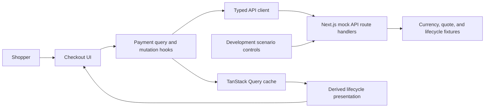

# Technical Architecture

Status: Foundation scaffolded; contract implementation in progress
Scope: Architecture and implementation baseline

## Goals

The architecture must make the following properties easy to verify and explain:

- Quote fields cannot become internally inconsistent during selection changes.
- Server payment status has one authoritative owner.
- Expiration and polling cannot race into an unsafe shopper experience.
- Money never passes through binary floating-point arithmetic.
- Every documented status is handled exhaustively.
- Mock scenarios are deterministic enough for demonstration and automated tests.
- A new requirement can be added during the follow-up interview without
  restructuring the application.

## Proposed technology choices

| Concern | Proposed choice | Reason |
| --- | --- | --- |
| Application framework | Next.js 16.3.1 App Router with strict TypeScript | Stable registry release verified on 2026-08-17, published after the July security release. It matches Triple-A's stack and avoids canary/preview dependencies. |
| UI runtime | React and React DOM 19.2.8 | Stable registry releases verified on 2026-08-17 and newer than the patched baselines for the disclosed React Server Components vulnerabilities. |
| Package manager | pnpm 11.22.0 | Fast, deterministic installs; efficient content-addressable storage; strict dependency boundaries. Pin through `packageManager` and commit `pnpm-lock.yaml`. |
| Server runtime | Node.js 24.18.0 LTS | Current Node 24 LTS patch on 2026-08-17; exact development pin prevents environment drift. |
| Styling | Tailwind CSS | Requested preference; supports a small, consistent design system without a large component dependency. |
| Remote state | TanStack Query | Owns fetching, mutation state, cancellation, retries, cache identity, and status polling. |
| Client global state | None initially | There is no demonstrated cross-route or cross-feature client state that justifies Redux. |
| Runtime validation | Zod | Converts untrusted mock/API JSON into explicit domain-safe values. |
| Decimal arithmetic | `big.js` with strict mode | Small, dependency-free exact decimal comparison/subtraction; strict mode rejects primitive number construction and imprecise number conversion. |
| QR generation | `qrcode.react`, rendered locally as SVG | Maintained React 19-compatible renderer; avoids remote payment-data disclosure and keeps the encoded payload testable. |
| Unit/integration testing | Vitest and React Testing Library | Fast deterministic tests for domain rules, hooks, and state presentations. |
| Browser testing | Playwright | Verifies a small number of critical shopper journeys and background/resume behavior. |
| Mock API | Next.js route handlers backed by a deterministic development scenario store | Exercises the real HTTP boundary and keeps one run command. |

## Test runner and application bundler are separate

Vitest uses Vite internally to transform modules in the test process. This does
not make the application a Vite application and does not add Vite as an
application runtime or production build target.

- `pnpm dev` and `pnpm build` execute Next.js with its default Turbopack bundler.
- Vitest executes pure domain modules, hooks, and client components under Node
  or jsdom.
- React Testing Library exercises behavior through the rendered DOM rather than
  component internals.
- Playwright starts or connects to the actual Next.js application and covers
  route handlers, browser behavior, and critical shopper journeys.
- Async Server Components are covered through browser-level tests where unit
  tool support is incomplete. The interactive checkout remains primarily a
  client-component surface behind a small App Router composition boundary.

MSW is not part of the initial tool set. Next.js route handlers already provide
the required HTTP mock boundary, and Playwright will exercise it. Add another
mock layer only if a concrete isolated component-test need outweighs the risk of
maintaining duplicate transport behavior.

## Why Redux Toolkit is not currently justified

The main complex state in this exercise is remote payment state. TanStack Query
already models its lifecycle. Mirroring it into Redux would create two sources
of truth and require synchronization rules for:

- active payment reference;
- current quote;
- polling result;
- quote mutation result;
- transport errors;
- invalidation after requote.

Currency/network selection can remain close to the selector and quote mutation.
Development scenario settings belong to the mock-development surface and do
not need production global state.

Redux Toolkit should be added only if implementation reveals independently
changing client state shared by distant components that cannot be expressed
cleanly through composition or URL/local state. This is an architectural gate,
not a ban on Redux.

## System boundary



The production-facing UI must depend on the HTTP contract, not import fixtures
or mock state directly. This prevents the mock implementation from leaking into
the checkout domain.

## Proposed module boundaries

```text
src/
  app/
    api/
      currencies/route.ts
      payments/route.ts
      payments/[reference]/route.ts
      payments/[reference]/requote/route.ts
      dev/scenario/route.ts
    page.tsx
    layout.tsx
    providers.tsx

  features/checkout/
    api/
      contracts/
        primitives.ts
        payment-method.ts
        currencies.ts
        payments.ts
        payment-status-values.ts
        payment-status.ts
        problem.ts
      checkout-api.ts
      checkout-query-keys.ts
    domain/
      payment-status.ts
      payment-presentation.ts
      money.ts
      quote-expiration.ts
    hooks/
      use-currencies.ts
      use-create-payment.ts
      use-payment-status.ts
      use-requote.ts
      use-quote-countdown.ts
    components/
      checkout-page.tsx
      order-summary.tsx
      payment-method-selector.tsx
      network-safety-notice.tsx
      payment-instructions.tsx
      payment-status-panel.tsx
      quote-countdown.tsx
      address-copy.tsx
      payment-qr.tsx
      connectivity-notice.tsx
      dev-scenario-panel.tsx

  mocks/
    fixtures/
    scenario-store.ts
    payment-simulator.ts

  shared/
    api/
    components/
    config/
```

The entire application source lives under `src/`. Next.js route entry points
live under `src/app`, while domain and feature code lives beside `app` rather
than inside route folders. This avoids mixing a root `app/` directory with a
partially separate `src/` tree.

The exact feature paths may change during implementation. The boundary is more
important than the folder spelling:

- Transport schemas do not contain UI copy.
- Domain functions do not import React.
- Components do not build endpoint URLs or parse JSON.
- Mock fixtures are not imported by production-facing components.

Transport contracts are split by protocol concern under `api/contracts/`
rather than accumulated in one large schema file. Zod schemas remain the source
of their inferred TypeScript types. Shared primitives may be exported from one
contract module only when their boundary meaning is identical; domain money
rules remain separate.

Closed behavioral vocabularies, such as payment statuses, use one readonly
tuple for both the runtime Zod enum and its TypeScript union. Server-owned
reference values are different: currency codes and network identifiers are
branded, structurally validated strings, and supported pairs are derived from
the latest validated catalog. This lets the backend add a valid payment method
without requiring a frontend enum release. Validated money and
safety-sensitive identifiers are branded at the boundary to prevent
structurally identical strings from being interchanged later.

Objects remain strict because this committed mock API is a fixed assessment
contract; a production integration with independently evolving additive fields
would require revisiting that compatibility policy. Open values and open object
shapes are separate compatibility decisions.

## Framework security baseline

The initial scaffold will pin the stable registry releases verified on
2026-08-17:

- `next` 16.3.1, published on 2026-08-13 after the July security release;
- `react` 19.2.8;
- `react-dom` 19.2.8;
- Node.js 24.18.0 LTS;
- pnpm 11.22.0.

This is a security decision, not a general policy of installing prereleases or
blindly following an `@latest` tag. The disclosed React Server Components
vulnerabilities included unauthenticated remote code execution, denial of
service, and source-code exposure. Next.js also published multiple framework
security advisories in 2026. We therefore use the newest stable, supported,
patched release line and explicitly avoid canary/preview versions.

Dependency policy:

1. Pin pnpm 11.22.0 in `package.json`, pin exact direct dependency versions,
   and commit `pnpm-lock.yaml`.
2. Use a stable, non-canary release from a supported Next.js line.
3. Recheck official React and Next.js security advisories immediately before
   submission and upgrade if a newer patched stable release supersedes this
   baseline.
4. Run the package-manager vulnerability audit after installation and before
   submission; investigate findings rather than applying unreviewed forced
   upgrades.
5. Confirm compatibility with TanStack Query, the test runner, and the selected
   Node.js LTS runtime.
6. Avoid experimental Next.js features. The design requires only stable App
   Router pages, layouts, providers, and route handlers.
7. Record the final installed versions, runtime requirement, advisory check
   date, and any accepted audit findings in the README and ADR-001.

Security evidence reviewed on 2026-08-17:

- Next.js July 2026 security release:
  <https://nextjs.org/blog>
- React Server Components security advisory and follow-up fixes:
  <https://react.dev/blog/2025/12/03/critical-security-vulnerability-in-react-server-components>
- Next.js installation and supported runtime guidance:
  <https://nextjs.org/docs/app/getting-started/installation>
- Node.js release status:
  <https://nodejs.org/en/about/previous-releases>
- npm registry stable tags and exact package metadata, queried through pnpm on
  2026-08-17.

## Data ownership

| Data | Owner | Lifetime |
| --- | --- | --- |
| Supported currencies and networks | TanStack Query cache | Application session with long stale time |
| Draft currency/network selection | Checkout composition/local state | Until quote creation succeeds |
| Issued currency/network | The validated quote in TanStack Query | Fixed for the lifetime of that quote |
| Created payment and quote | TanStack Query cache keyed by payment reference | Checkout session |
| Incremental status response | TanStack Query cache merged through a typed domain function | Until terminal state or requote |
| Countdown display value | Derived from `expires_at` and current time | Never persisted as authoritative state |
| Copy confirmation | Address component local state | A few seconds |
| Connectivity degradation | Query fetch/error state | While transport is degraded |
| Development scenario | Mock scenario controller | Local development only |

## API boundary

### `GET /api/currencies`

Responsibilities:

- Return every documented currency/network combination.
- Preserve fees as decimal strings.
- Supply confirmation metadata.

Client policy:

- Validate the full response.
- Accept structurally valid currencies, networks, and decimal scales rather
  than restricting the catalog to the examples in the assessment fixture.
- Derive network options from the selected currency.
- Never hard-code a second client-side compatibility matrix.

### `POST /api/payments`

Responsibilities:

- Validate `order_id`, `currency`, and `network`.
- Reject unsupported combinations with `application/problem+json`.
- Return an internally consistent payment and quote.
- Generate `expires_at` three minutes after request time so the checked-in
  fixture does not already appear expired and manual testing remains practical.
  Later development controls may trigger expiry immediately without changing
  the production countdown policy.

Client policy:

- Validate the requested currency/network pair against the latest catalog;
  identifier shape validation alone does not establish availability.
- Treat selection plus quote creation as a transaction from the shopper's
  perspective.
- Keep the previous consistent view during a new request only if it remains
  safe and clearly marked; otherwise use an explicit quote-loading state.
- Ensure a stale mutation response cannot replace a newer selection.

### `GET /api/payments/:reference`

Responsibilities:

- Return the selected deterministic scenario or progression step.
- Support configurable delay and transport/server failures.
- Record enough request information in development to demonstrate no overlap.

Client policy:

- Validate status-specific payloads as a discriminated union.
- Merge partial status payloads without erasing stable quote/order context.
- Keep transport errors separate from lifecycle statuses.

### `POST /api/payments/:reference/requote`

Responsibilities:

- Preserve the payment reference.
- Return a complete new quote and `awaiting_payment` status.
- Return the specified 409 problem response when requote is not allowed.

Client policy:

- Atomically replace every quote-dependent field.
- Reset time-derived presentation from the returned `expires_at`.
- Invalidate/restart active polling only after a successful response.

## Runtime contract model

Status updates should be modeled as a discriminated union. Conceptually:

```ts
type PaymentStatusUpdate =
  | AwaitingPaymentUpdate
  | DetectedUpdate
  | ConfirmingUpdate
  | PaidUpdate
  | UnderpaidUpdate
  | OverpaidUpdate
  | ExpiredUpdate
  | FailedUpdate;
```

Each variant should require exactly the fields needed to present that state.
Unknown or structurally invalid payloads become protocol errors, not payment
failures.

An exhaustive mapping function should transform this union into shopper-facing
presentation data. A `never` exhaustiveness check makes a newly added status a
compile-time implementation task.

## Quote identity and race prevention

Currency/network changes can create overlapping mutation responses even if
status polling itself never overlaps. The design needs an explicit policy.

Proposed policy:

1. Each quote request captures its currency/network pair.
2. A new selection cancels the previous request where cancellation is
   supported.
3. A response is accepted only if its pair still matches the current intended
   selection.
4. The full quote object is committed atomically; individual fields are never
   updated independently.
5. Polling for a previous payment reference is cancelled before the new
   reference becomes active.

### Method-change safety

After a quote is accepted, its currency and network are fixed quote properties.
Do not keep them as freely editable controls beside the active address and QR.

While status is `awaiting_payment`, expose a guarded method-change action. It
must:

- explain that changing is safe only if the shopper has not sent funds;
- require explicit confirmation;
- deactivate the current instructions before returning to selection;
- request and commit a complete new quote atomically;
- prevent an obsolete response from restoring the old instruction set.

At `detected` or later, remove method changing entirely.

Do not use address copy, QR rendering, or an assumed QR scan as a lifecycle
signal. The supplied API exposes no such event. The first authoritative evidence
of an external transfer is the polled `detected` status.

## Countdown model

Do not store and decrement "seconds remaining" as authoritative state.

```text
displayed remaining time = max(0, expires_at - corrected current time)
```

A low-frequency UI timer causes re-rendering only. On visibility change and
focus, recompute immediately. Browser timer throttling therefore affects only
how often the screen repaints, not the calculated deadline.

Device-clock skew cannot be fully solved from the supplied body contract. The
technical design will evaluate whether to derive a server offset from the HTTP
`Date` header. If that path is unreliable across the chosen runtime, the
limitation will be documented rather than hidden behind false precision.

## Polling model

Prefer TanStack Query's request lifecycle over a raw `setInterval`.

Dynamic polling policy:

- `awaiting_payment`: poll every 3 seconds.
- `detected`: poll every 1.5 seconds because the shopper is actively waiting.
- `confirming`: poll every 2 seconds. The quote does not carry average network
  confirmation time, so the client does not couple active polling to a possibly
  stale catalog entry.
- `underpaid`: continue every 3 seconds under the accepted provisional
  non-terminal interpretation.
- terminal statuses: return `false` from the interval policy.
- transport failure: retry automatically at 1, 2, and 4 seconds, then preserve
  the last good data and require automatic recovery on a later interval or an
  explicit manual retry.

These are named implementation constants with deterministic tests. They are a
responsive assessment policy and do not pretend the mock's timing represents
real chain timing.

## Mock scenario design

The evaluator needs direct control and tests need determinism. The mock should
support two modes:

1. **Exact state:** pin the payment to one documented status.
2. **Progression:** advance through an explicit sequence for the happy path.

Status payloads are generated from the stored issued quote so amount, address,
and confirmation metadata remain coherent. Because a one-confirmation method
has no valid positive intermediate confirmation count, its happy path advances
from `detected` directly to `paid`; multi-confirmation methods include
`confirming`. Literal source examples that conflict with one another remain
covered independently at the contract boundary instead of being combined into
an unsafe live scenario.

Orthogonal transport controls:

- response delay in milliseconds;
- fail the next request;
- persistent failure mode;
- selectable HTTP 500 versus simulated network disconnect where feasible.

The committed store defaults each newly created payment to an exact
`awaiting_payment` state. Re-registering the assessment's deterministic
reference replaces its prior mock session and resets all controls. Delay is
validated from zero through 30 seconds. One-shot and persistent failures are
consumed before lifecycle simulation so a failed transport attempt never
advances the payment. The singleton is kept on the server process global to
survive development hot reload and is intentionally not multi-instance or
deployment-safe.

Scenario controls must be visibly marked development-only and must exercise the
same HTTP endpoints as normal behavior. They must not set React query data
directly.

`GET` and `PUT /api/dev/scenario` expose the validated configuration for the
later development panel and automated HTTP checks. They are available only when
`NODE_ENV` is not `production`, use no-store responses, and require a registered
payment reference. The status route models a network disconnect with an errored
response stream; real Next.js verification produces an empty client reply and
an expected server-side pipe error rather than a lifecycle payload.

## Accessibility requirements

- Semantic headings reflect the page and status hierarchy.
- Status changes use a carefully chosen live region that does not announce each
  countdown tick.
- Copy confirmation is announced without moving focus.
- Every field and selector has a programmatic label.
- Keyboard focus remains visible.
- Error/recovery actions are reachable and descriptive.
- Network safety does not rely on color, token icon, or address shape.
- Long addresses wrap or truncate visually without changing copied content.
- Motion respects `prefers-reduced-motion`.
- Small-screen touch targets meet a minimum comfortable size.

## Security and integrity considerations

Although this is a mock checkout, the design should reflect payment-page risks:

- Render addresses and hashes as text, never HTML.
- Construct QR payloads from validated quote data only.
- Avoid third-party remote QR/image services that disclose payment data.
- Do not log full payment instructions unnecessarily.
- Validate route parameters and request bodies.
- Prevent development controls from being presented as production functionality.
- Do not infer the network from the address; use explicit quote metadata.

## Deliberate simplicity

The proposal avoids:

- A client-side state-machine library: eight server-owned statuses and a small
  set of derived modes do not yet justify one.
- Redux duplication of server state.
- WebSockets: polling is explicitly required.
- A design-system dependency: it would add surface area without improving the
  scored risks.
- Premature generic abstractions for arbitrary merchants or chains.

These choices keep the application explainable during the follow-up extension
exercise.
