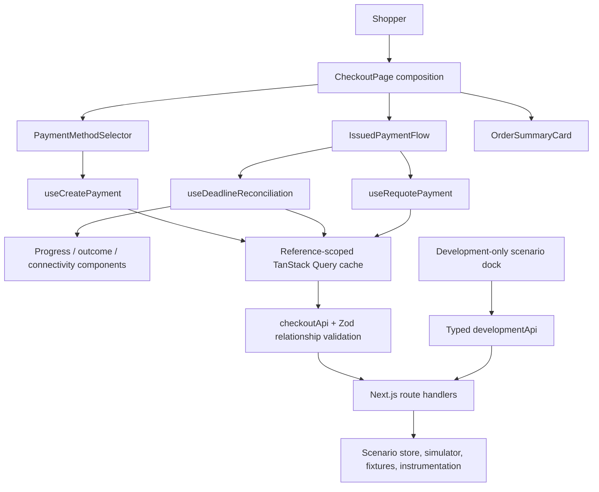
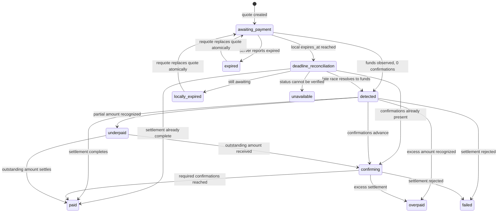

# Technical Architecture

Status: Implemented design; reconciled with the final M7 verification boundary
Scope: Final design document for the submitted hosted checkout

## Goals

The architecture must make the following properties easy to verify and explain:

- Quote fields cannot become internally inconsistent during selection changes.
- Server payment status has one authoritative owner.
- Expiration and polling cannot race into an unsafe shopper experience.
- Money never passes through binary floating-point arithmetic.
- Every documented status is handled exhaustively.
- Mock scenarios are deterministic enough for demonstration and automated tests.
- A new requirement can be added during the follow-up interview without
  restructuring the application.

## Implemented technology choices

| Concern | Implemented choice | Reason |
| --- | --- | --- |
| Application framework | Next.js 16.3.1 App Router with strict TypeScript | Stable registry release verified on 2026-08-17, published after the July security release. It matches Triple-A's stack and avoids canary/preview dependencies. |
| UI runtime | React and React DOM 19.2.8 | Stable registry releases verified on 2026-08-17 and newer than the patched baselines for the disclosed React Server Components vulnerabilities. |
| Package manager | pnpm 11.22.0 | Fast, deterministic installs; efficient content-addressable storage; strict dependency boundaries. Pin through `packageManager` and commit `pnpm-lock.yaml`. |
| Server runtime | Node.js 24.19.0 LTS | Current Node 24 LTS release verified on 2026-08-18; includes the July 29 security fixes and supersedes the original 24.18.0 pin. |
| Styling | Tailwind CSS | Requested preference; supports a small, consistent design system without a large component dependency. |
| Remote state | TanStack Query 5.101.4 | Owns fetching, mutation state, cancellation, retries, cache identity, and status polling. |
| Client global state | None initially | There is no demonstrated cross-route or cross-feature client state that justifies Redux. |
| Runtime validation | Zod | Converts untrusted mock/API JSON into explicit domain-safe values. |
| Decimal arithmetic | `big.js` with strict mode | Small, dependency-free exact decimal comparison/subtraction; strict mode rejects primitive number construction and imprecise number conversion. |
| QR generation | `qrcode.react`, rendered locally as SVG | Maintained React 19-compatible renderer; avoids remote payment-data disclosure and keeps the encoded payload testable. |
| Unit/integration testing | Vitest and React Testing Library | Fast deterministic tests for domain rules, hooks, and state presentations. |
| Browser testing | Playwright | Verifies a small number of critical shopper journeys and background/resume behavior. |
| Accessibility testing | `@axe-core/playwright` plus focused browser checks | Scans the primary flow and every materially different lifecycle outcome; supplements keyboard, mobile, contrast, reduced-motion, and semantic assertions. |
| Mock API | Next.js route handlers backed by a deterministic development scenario store | Exercises the real HTTP boundary and keeps one run command. |

## Test runner and application bundler are separate

Vitest uses Vite internally to transform modules in the test process. This does
not make the application a Vite application and does not add Vite as an
application runtime or production build target.

- `pnpm dev` and `pnpm build` execute Next.js with its default Turbopack bundler.
- Vitest executes pure domain modules, hooks, and client components under Node
  or jsdom.
- React Testing Library exercises behavior through the rendered DOM rather than
  component internals.
- Playwright starts or connects to the actual Next.js application and covers
  route handlers, browser behavior, and critical shopper journeys.
- Async Server Components are covered through browser-level tests where unit
  tool support is incomplete. The interactive checkout remains primarily a
  client-component surface behind a small App Router composition boundary.

MSW is not part of the tool set. Next.js route handlers already provide the
required HTTP mock boundary, and Playwright exercises it. Add another
mock layer only if a concrete isolated component-test need outweighs the risk of
maintaining duplicate transport behavior.

## Why Redux Toolkit is not currently justified

The main complex state in this exercise is remote payment state. TanStack Query
already models its lifecycle. Mirroring it into Redux would create two sources
of truth and require synchronization rules for:

- active payment reference;
- current quote;
- polling result;
- quote mutation result;
- transport errors;
- invalidation after requote.

Currency/network selection can remain close to the selector and quote mutation.
Development scenario settings belong to the mock-development surface and do
not need production global state.

Redux Toolkit remains a review trigger rather than a submitted dependency. Add
it only if a future feature introduces independently changing client state
shared by distant components that cannot be expressed cleanly through
composition or URL/local state.

## Component structure and data flow



The App Router page supplies validated fixed checkout context and decides
whether development tooling is available. `CheckoutPage` owns only ephemeral
selection and dock visibility. TanStack Query owns every server-derived quote,
status, retry, and mutation lifecycle. Components render already validated
data; they do not build URLs, parse JSON, or import mock state.

The mock and shopper surfaces meet only through HTTP. The development dock also
uses a typed client and route handlers rather than importing or mutating the
scenario store. Its mutation callbacks may commit validated HTTP responses to
the appropriate TanStack Query key, but they never fabricate payment data.
That preserves the same serialization, delay, validation, and transport
behavior exercised by the shopper.

## Implemented module boundaries

```text
src/
  app/
    api/
      currencies/route.ts
      payments/route.ts
      payments/[reference]/route.ts
      payments/[reference]/requote/route.ts
      dev/scenario/route.ts
      dev/requests/route.ts
      dev/quote-expiry/route.ts
    page.tsx
    layout.tsx
    providers.tsx

  features/checkout/
    api/
      contracts/                 Zod HTTP schemas and inferred types
      checkout-api.ts
      development-api.ts
      checkout-query-keys.ts
      http-json.ts
      validate-api-response.ts
      validate-payment.ts
      validate-payment-status.ts
    config/
      checkout-session.ts
    domain/
      payment-status.ts
      payment-presentation.ts
      money.ts
      quote-expiration.ts
      payment-polling.ts
      payment-status-retry.ts
      polling-policy.ts
    hooks/
      use-currencies.ts
      use-create-payment.ts
      use-deadline-reconciliation.ts
      use-requote-payment.ts
      use-quote-countdown.ts
    components/
      checkout/                  Page composition and order context
        checkout-page.tsx
        checkout-layout.tsx
        checkout-payment-panel.tsx
        order-summary.tsx
      payment-method/            Catalog choice and issued-method commitment
        payment-method-selector.tsx
        payment-method-commitment.tsx
      payment-instructions/      One quote's amount, QR, address, and deadline
        payment-instructions.tsx
        payment-qr.tsx
        address-copy.tsx
        quote-countdown.tsx
        network-safety-notice.tsx
      payment-status/            Polling integration and lifecycle outcomes
        issued-payment-flow.tsx
        authoritative-payment-status.tsx
        quote-deadline-status.tsx
        payment-progress-status.tsx
        payment-outcome-status.tsx
        payment-underpaid-status.tsx
        payment-terminal-outcomes.tsx
        payment-connectivity-notice.tsx
      development/               Development-only evaluator controls
        development-scenario-panel.tsx
        development-scenario-form.tsx
        development-scenario-form-model.ts
        development-payment-state-fields.tsx
        development-network-condition-fields.tsx
        development-quote-expiry-control.tsx
        development-request-diagnostics.tsx
        development-tools-shell.tsx

  mocks/
    fixtures/currencies.ts
    quote-factory.ts
    payment-reference-factory.ts
    scenario-store.ts
    payment-simulator.ts
    request-instrumentation.ts
```

The entire application source lives under `src/`. Next.js route entry points
live under `src/app`, while domain and feature code lives beside `app` rather
than inside route folders. This avoids mixing a root `app/` directory with a
partially separate `src/` tree.

No `shared/` directory was created because no cross-feature abstraction was
proven necessary. The implemented boundary rules are:

- Transport schemas do not contain UI copy.
- Domain functions do not import React.
- Components do not build endpoint URLs or parse JSON.
- Mock fixtures are not imported by production-facing components.

Transport contracts are split by protocol concern under `api/contracts/`
rather than accumulated in one large schema file. Zod schemas remain the source
of their inferred TypeScript types. Shared primitives may be exported from one
contract module only when their boundary meaning is identical; domain money
rules remain separate.

Closed behavioral vocabularies, such as payment statuses, use one readonly
tuple for both the runtime Zod enum and its TypeScript union. Server-owned
reference values are different: currency codes and network identifiers are
branded, structurally validated strings, and supported pairs are derived from
the latest validated catalog. This lets the backend add a valid payment method
without requiring a frontend enum release. Validated money and
safety-sensitive identifiers are branded at the boundary to prevent
structurally identical strings from being interchanged later.

Objects remain strict because this committed mock API is a fixed assessment
contract; a production integration with independently evolving additive fields
would require revisiting that compatibility policy. Open values and open object
shapes are separate compatibility decisions.

Component folders follow shopper responsibilities rather than technical file
types. Tests stay beside the component boundary they exercise. The checkout
folder composes the flow but does not absorb method, instruction, lifecycle, or
development behavior; those responsibilities can therefore change without
turning `checkout-page.tsx` into a second application layer.

## Framework security baseline

The submitted baseline pins the stable registry/runtime releases rechecked on
2026-08-18:

- `next` 16.3.1, published on 2026-08-13 after the July security release;
- `react` 19.2.8;
- `react-dom` 19.2.8;
- Node.js 24.19.0 LTS, superseding 24.18.0 after the July 29 Node security release;
- pnpm 11.22.0.

This is a security decision, not a general policy of installing prereleases or
blindly following an `@latest` tag. The disclosed React Server Components
vulnerabilities included unauthenticated remote code execution, denial of
service, and source-code exposure. Next.js also published multiple framework
security advisories in 2026. We therefore use the newest stable, supported,
patched release line and explicitly avoid canary/preview versions.

Dependency policy:

1. Pin pnpm 11.22.0 in `package.json`, pin exact direct dependency versions,
   and commit `pnpm-lock.yaml`.
2. Use a stable, non-canary release from a supported Next.js line.
3. Recheck official React and Next.js security advisories immediately before
   submission and upgrade if a newer patched stable release supersedes this
   baseline.
4. Run the package-manager vulnerability audit after installation and before
   submission; investigate findings rather than applying unreviewed forced
   upgrades.
5. Confirm compatibility with TanStack Query, the test runner, and the selected
   Node.js LTS runtime.
6. Avoid experimental Next.js features. The design requires only stable App
   Router pages, layouts, providers, and route handlers.
7. Record the final installed versions, runtime requirement, advisory check
   date, and any accepted audit findings in the README and ADR-001.

Security evidence reviewed on 2026-08-18:

- Next.js July 2026 security release and current Active LTS policy:
  <https://nextjs.org/blog/july-2026-security-release> and
  <https://nextjs.org/support-policy>
- Next.js 16.3 stable announcement (released after the July patches):
  <https://nextjs.org/blog/next-16-3>
- React Server Components security advisory and follow-up fixes:
  <https://react.dev/blog/2025/12/03/critical-security-vulnerability-in-react-server-components>
  and
  <https://react.dev/blog/2025/12/11/denial-of-service-and-source-code-exposure-in-react-server-components>
- Node.js July 29 security release and current Node 24 LTS archive:
  <https://nodejs.org/en/blog/vulnerability/july-2026-security-releases> and
  <https://nodejs.org/en/download/archive/v24>
- npm registry stable tags and exact package metadata, queried through pnpm on
  2026-08-18: Next.js 16.3.1 and React/React DOM 19.2.8 remain `latest`.

## Data ownership

| Data | Owner | Lifetime |
| --- | --- | --- |
| Merchant/order checkout context | Validated hosted-page session input | Hosted checkout session |
| Supported currencies and networks | TanStack Query cache | Application session with long stale time |
| Draft currency/network selection | Checkout composition/local state | Until quote creation succeeds |
| Issued currency/network | The validated quote in TanStack Query | Fixed for the lifetime of that quote |
| Created payment and quote | TanStack Query cache keyed by payment reference | Checkout session |
| Incremental status response | TanStack Query cache merged through a typed domain function | Until terminal state or requote |
| Countdown display value | Derived from `expires_at` and current time | Never persisted as authoritative state |
| Copy confirmation | Address component local state | A few seconds |
| Connectivity degradation | Query fetch/error state | While transport is degraded |
| Development scenario | Mock scenario controller | Local development only |

## API boundary

### Implemented client boundary

`src/features/checkout/api/checkout-api.ts` is the only shopper-facing module
that constructs the assessment endpoint paths or reads response JSON. It:

- accepts an `AbortSignal` for every operation so TanStack Query can cancel
  obsolete requests;
- validates outbound request bodies and payment references;
- treats response bodies as `unknown` until the operation's Zod schema accepts
  them;
- checks the expected success status and agreement between an error body's
  status and the actual HTTP status;
- throws `ApiProblemError` for a valid `application/problem+json` model and
  `ProtocolError` for malformed or unknown protocol data;
- preserves fetch, abort, and response-stream failures as transport errors
  rather than turning them into payment lifecycle states.

The fetch implementation is injectable for focused tests, while the exported
browser instance uses same-origin relative paths. Query keys live in one
feature-owned factory. Payment-status keys include the validated payment
reference, preventing one payment's response from sharing another payment's
cache identity.

The App Router layout renders a client provider around `children`, leaving the
HTML shell as a Server Component. Following the current TanStack App Router
guidance, server renders receive a fresh `QueryClient`, while the browser keeps
one client for the application session. Polling and retry defaults are
operation-specific rather than unsafe global defaults.

### `GET /api/currencies`

Responsibilities:

- Return every documented currency/network combination.
- Preserve fees as decimal strings.
- Supply confirmation metadata.

Client policy:

- Validate the full response.
- Accept structurally valid currencies, networks, and decimal scales rather
  than restricting the catalog to the examples in the assessment fixture.
- Derive network options from the selected currency.
- Never hard-code a second client-side compatibility matrix.

### `POST /api/payments`

Responsibilities:

- Validate `order_id`, `currency`, and `network`.
- Reject unsupported combinations with `application/problem+json`.
- Return an internally consistent payment and quote.
- Generate `expires_at` three minutes after request time so the checked-in
  fixture does not already appear expired and manual testing remains practical.
  Development controls can set the authoritative status to `expired`, while
  fake-clock browser tests exercise the real local-deadline path.

Client policy:

- Validate the requested currency/network pair against the latest catalog;
  identifier shape validation alone does not establish availability.
- Treat selection plus quote creation as a transaction from the shopper's
  perspective.
- Keep the previous consistent view during a new request only if it remains
  safe and clearly marked; otherwise use an explicit quote-loading state.
- Ensure a stale mutation response cannot replace a newer selection.

### `GET /api/payments/:reference`

Responsibilities:

- Return the selected deterministic scenario or progression step.
- Support configurable delay and transport/server failures.
- Record enough request information in development to demonstrate no overlap.

Client policy:

- Validate status-specific payloads as a discriminated union.
- Merge partial status payloads without erasing stable quote/order context.
- Keep transport errors separate from lifecycle statuses.

### `POST /api/payments/:reference/requote`

Responsibilities:

- Preserve the payment reference.
- Return a complete new quote and `awaiting_payment` status.
- Return the specified 409 problem response when requote is not allowed.

Client policy:

- Atomically replace every quote-dependent field.
- Reset time-derived presentation from the returned `expires_at`.
- Invalidate/restart active polling only after a successful response.

## Runtime contract model

Status updates are modeled as a strict discriminated union:

```ts
type PaymentStatusUpdate =
  | AwaitingPaymentUpdate
  | DetectedUpdate
  | ConfirmingUpdate
  | PaidUpdate
  | UnderpaidUpdate
  | OverpaidUpdate
  | ExpiredUpdate
  | FailedUpdate;
```

Each variant requires exactly the fields needed to present that state.
Unknown or structurally invalid payloads become protocol errors, not payment
failures.

`assertPaymentStatusMatchesQuote` applies quote-aware semantic validation before
a status update can enter the query cache or UI. Every status money field must fit the issued asset's
catalog-provided precision. Detected, confirming, and paid confirmation targets
must match the issued quote. An underpayment's destination must remain the
issued quote address before it can be shown, copied, or encoded into a QR.
These checks also protect the immediate status refresh after a requote conflict.

## Implemented lifecycle model



`deadline_reconciliation`, `locally_expired`, and `unavailable` are client
presentation phases, not invented API statuses. Transport retry/failure is an
orthogonal query condition and never enters this lifecycle union. `paid`,
`overpaid`, `expired`, and `failed` stop polling. `underpaid` remains active
because its contract supplies both the outstanding amount and destination for a
same-reference top-up.

### Issued-quote monetary integrity

The currency catalog remains the runtime source of asset precision. When a
shopper selects a method, quote creation captures that catalog precision with
the request intent. Before a successful quote can enter the query cache or UI:

- `crypto_amount`, `network_fee`, and `total_due` must each fit that asset's
  API-provided decimal scale;
- exact decimal arithmetic must prove that `total_due` equals
  `crypto_amount + network_fee`; and
- the original validated decimal strings remain authoritative for display.

This semantic validation happens after structural HTTP parsing and before
mutation success. A violation is a protocol error and produces no usable
payment instructions. The UI never rounds or reconstructs the server's
transfer strings.

`getPaymentPresentation` exhaustively transforms this union into shopper-facing
presentation data. A `never` exhaustiveness check makes a newly added status a
compile-time implementation task.

## Quote identity and race prevention

Currency/network changes can create overlapping mutation responses even if
status polling itself never overlaps. Implemented policy:

1. Each quote request captures its currency/network pair.
2. A new selection cancels the previous request where cancellation is
   supported.
3. A response is accepted only if its pair still matches the current intended
   selection.
4. The full quote object is committed atomically; individual fields are never
   updated independently.
5. Polling for a previous payment reference is cancelled before the new
   reference becomes active.

`useCreatePayment` implements points 1-4 with one mutation intent id per selection, an
`AbortController` for the superseded request, request/response pair validation,
and an intent-id guard before the complete payment enters its
reference-specific query cache. Tests deliberately make the old transport
ignore cancellation and resolve after the new quote; the obsolete response is
not cached and does not replace the visible quote. Unmounting the old issued
flow consumes the reference-scoped status query signal, so obsolete polling is
cancelled before a replacement becomes active.

### Method-change safety

After a quote is accepted, its currency and network are fixed quote properties.
Do not keep them as freely editable controls beside the active address and QR.

While status is `awaiting_payment`, expose a direct method-change action. It
must:

- deactivate the current instructions before returning to selection;
- avoid an intermediate confirmation dialog when the action is available;
- request and commit a complete new quote atomically;
- prevent an obsolete response from restoring the old instruction set.

At `detected` or later, remove method changing entirely.

The checkout replaces selection controls
with a fixed issued-method summary as soon as a quote succeeds. Activating
"Change payment method" removes the active quote from the rendered flow and
returns directly to selection. The abandoned payment remains
reference-addressable in the query cache; it cannot silently become the active
instruction again. `IssuedPaymentFlow` renders this action only in the active
`awaiting_payment` phase and removes it at `detected` or later.

Do not use address copy, QR rendering, or an assumed QR scan as a lifecycle
signal. The supplied API exposes no such event. The first authoritative evidence
of an external transfer is the polled `detected` status.

## Countdown model

Do not store and decrement "seconds remaining" as authoritative state.

```text
displayed remaining time = max(0, expires_at - corrected current time)
```

A low-frequency UI timer causes re-rendering only. On visibility change and
focus, recompute immediately. Browser timer throttling therefore affects only
how often the screen repaints, not the calculated deadline.

`useQuoteCountdown` implements this with one self-scheduling timeout aligned to the next visible
second. Each repaint stores only a fresh `Date.now()` observation and derives
remaining time from the absolute validated deadline. Focus and return to a
visible document force the same calculation immediately. A changed
`expires_at` replaces the pending timeout; zero and unmount remove it. The timer
has `aria-live="off"`, so assistive technology is not asked to announce every
tick.

At the first zero observation, the issued flow immediately removes amount,
address, QR, copy, and method-change actions before an effect runs. The existing
active TanStack status query is explicitly refetched under its reference-
specific key; `cancelRefetch: false` joins an in-flight request instead of
starting another. `awaiting_payment` permits local expiry; any returned
authoritative status wins; a transport or protocol error produces an
indeterminate connectivity state and never claims expiry. The attempt guard is
scoped to the payment reference plus complete quote lifetime through the keyed
issued-flow boundary.

Device-clock skew cannot be fully solved from the supplied body contract. The
implementation deliberately does not claim server-clock correction from an
HTTP `Date` header because the contract does not guarantee a reliable timestamp
or offset policy. Absolute-time recomputation solves background throttling, not
a badly skewed shopper device; this remains a documented limitation.

## Polling model

Prefer TanStack Query's request lifecycle over a raw `setInterval`.

Dynamic polling policy:

- `awaiting_payment`: poll every 3 seconds.
- `detected`: poll every 1.5 seconds because the shopper is actively waiting.
- `confirming`: poll every 2 seconds. The quote does not carry average network
  confirmation time, so the client does not couple active polling to a possibly
  stale catalog entry.
- `underpaid`: continue every 3 seconds for the same payment reference.
- terminal statuses: return `false` from the interval policy.
- transport failure: retry automatically at 1, 2, and 4 seconds, then preserve
  the last good data and require automatic recovery on a later interval or an
  explicit manual retry.

These are named implementation constants with deterministic tests. They are a
responsive assessment policy and do not pretend the mock's timing represents
real chain timing.

The active polling and retry implementation uses the same reference-scoped TanStack query
used by deadline reconciliation. The first status request starts when issued
instructions mount. The next interval is selected from the last validated
status only after the current request settles, and deadline reconciliation
joins an already in-flight request instead of starting another. A locally
confirmed expiry disables its otherwise-awaiting interval until requote.
Reference changes and unmount consume the query signal and abort obsolete
transport work. When a validated status proves funds arrived, expiration is
disabled and its timer/focus/visibility listeners are removed. Fake-time tests
prove dynamic intervals, a maximum of one unresolved request, terminal stop,
and cancellation cleanup. Retryable fetch/stream failures and validated server
problems retry after 1, 2, and 4 seconds. Protocol violations and non-server
problems do not retry aggressively. The last validated business state remains
visible throughout, automatic polling can recover later, and exhausted retries
offer a manual status refresh without implying failure or expiry.

## Shopper-facing failure handling

| Condition | Preserved truth | Shopper presentation and safe action |
| --- | --- | --- |
| Currency catalog cannot load | No payment has started. | Accessible error with retry; no selector or invented methods. |
| Quote creation fails | No instructions were issued. | Keep the chosen method context and allow a safe quote retry. |
| Slow status response | Last validated payment state. | Keep that state visible; never infer that funds were not detected. |
| Retryable status transport/server failure | Last validated payment state and reference. | Bounded automatic retries, explicit connectivity notice, then manual retry; never map to `failed` or `expired`. |
| Malformed or unknown status response | Last validated payment state and reference. | Reject as a protocol error and say the update could not be verified. |
| Local deadline reached | Instructions are no longer known safe, but payment status is not yet known. | Hide transfer actions and reconcile once before showing local expiry. |
| Requote returns 409 | Previous instructions remain inactive; the payment may have changed. | Show the problem detail, refresh authoritative status, and ask the shopper to review it. |
| `underpaid` | Partial funds are recognized. | Show only the exact outstanding amount on the same network/address and continue polling for the same payment reference. |
| `overpaid` | Excess funds are recognized. | Tell the shopper not to send more and retain the reference; never promise a refund. |
| `failed` | Settlement was rejected. | Preserve the reference and direct the shopper to support; never instruct another full payment. |

Every state or failure treatment answers what happened, whether payment is
recognized or still expected, and what the shopper should do next. Text,
headings, actions, and live-region semantics carry meaning independently of
color.

## Mock scenario design

The evaluator needs direct control and tests need determinism. The mock
supports two modes:

1. **Exact state:** pin the payment to one documented status.
2. **Progression:** advance through an explicit sequence for the happy path.

Status payloads are generated from the stored issued quote so amount, address,
and confirmation metadata remain coherent. Because a one-confirmation method
has no valid positive intermediate confirmation count, its happy path advances
from `detected` directly to `paid`; multi-confirmation methods include
`confirming`. Literal source examples that conflict with one another remain
covered independently at the contract boundary instead of being combined into
an unsafe live scenario.

Orthogonal transport controls:

- response delay in milliseconds;
- fail the next request;
- persistent failure mode;
- selectable HTTP 500 versus simulated network disconnect where feasible.

An independent quote-deadline control moves the current quote's absolute
`expires_at` value to 0–600 seconds from now without changing payment status.
`POST /api/dev/quote-expiry` validates the request and returns the complete
updated payment through the same HTTP contracts. The dock commits that
validated response to the payment query so the shopper countdown updates from
one coherent quote snapshot.

The committed store defaults each newly created payment to an exact
`awaiting_payment` state. Creation allocates a distinct process-local reference
for every checkout, preventing another browser tab or test run from replacing
an open shopper's quote and scenario. Requote deliberately preserves that
reference. Delay is validated from zero through 30 seconds. One-shot and
persistent failures are consumed before lifecycle simulation so a failed
transport attempt never advances the payment. The singleton store and reference
sequence are kept on the server process global to survive development hot reload
and are intentionally not multi-instance or deployment-safe.

Scenario controls must be visibly marked development-only and must exercise the
typed development HTTP boundary. They may commit validated mutation responses
to TanStack Query, but must not fabricate payment data or bypass HTTP by
importing the mock store.

`GET` and `PUT /api/dev/scenario` expose the validated configuration for the
development panel and automated HTTP checks. They are available only when
`NODE_ENV` is not `production`, use no-store responses, and require a registered
payment reference. `POST /api/dev/quote-expiry` follows the same production
exclusion and reference-validation policy. The status route models a network
disconnect with an errored response stream; real Next.js verification produces
an empty client reply and
an expected server-side pipe error rather than a lifecycle payload.

Development status requests are instrumented per payment reference with the
current in-flight count, maximum in-flight count, and total started/completed
counts. `GET` and `DELETE /api/dev/requests` expose and reset those validated
metrics outside production. The shopper application never imports or mutates
the instrumentation. The development-only dock uses a typed, Zod-validated
HTTP client and renders every status, progression, delay, failure, and metric
control in an explicitly separate complementary region. It is hidden behind a
labelled launcher, toggles with Cmd/Ctrl+Shift+K, shifts the checkout canvas on
wide screens, becomes a bottom sheet on small screens, and restores launcher
focus when closed. A Playwright journey
holds a real status response open beyond the normal polling interval and uses
the HTTP metrics to prove a maximum of one in-flight request.

## Accessibility design and evidence

- Semantic headings reflect the page and status hierarchy.
- Status changes use a carefully chosen live region that does not announce each
  countdown tick.
- Copy confirmation is announced without moving focus.
- Every field and selector has a programmatic label.
- Keyboard focus remains visible.
- Error/recovery actions are reachable and descriptive.
- Network safety does not rely on color, token icon, or address shape.
- Long addresses wrap or truncate visually without changing copied content.
- Motion respects `prefers-reduced-motion`.
- Small-screen touch targets meet a minimum comfortable size.

The final browser matrix uses Axe on method selection, active instructions, and
all seven non-awaiting outcomes. The first run exposed a real skipped heading
level in the currency groups; the implementation and a component regression
now enforce level-two group headings. The completed matrix reports zero Axe
violations. Separate browser assertions cover keyboard-only quote issuance,
direct method changing without an alert dialog, immediate removal of old
instructions, copy announcements, a 390px viewport, address and QR fit, a
desktop QR panel spanning the full transfer-instruction summary beside the
exact amount and countdown, 44px controls, reduced motion, and measured contrast
for normal, warning, success, and error treatments.

## Security and integrity considerations

Although this is a mock checkout, the design should reflect payment-page risks:

- Render addresses and hashes as text, never HTML.
- Construct QR payloads from validated quote data only.
- Avoid third-party remote QR/image services that disclose payment data.
- Do not log full payment instructions unnecessarily.
- Validate route parameters and request bodies.
- Prevent development controls from being presented as production functionality.
- Do not infer the network from the address; use explicit quote metadata.

The implementation uses exact `qrcode.react` 4.2.0 to generate an inline SVG in the browser.
The payload is the validated `crypto_address` string and is the same value
passed to the visible/copyable address component. The QR includes a four-module
quiet zone and an accessible name containing the asset and explicit network.
It embeds no logo or remote image and initiates no external request. Per the
assessment contract and candidate discussion, it does not invent an
asset-specific payment URI that the backend did not supply.

## Deliberate simplicity

The implementation avoids:

- A client-side state-machine library: eight server-owned statuses and a small
  set of derived modes do not yet justify one.
- Redux duplication of server state.
- WebSockets: polling is explicitly required.
- A design-system dependency: it would add surface area without improving the
  scored risks.
- Premature generic abstractions for arbitrary merchants or chains.

These choices keep the application explainable during the follow-up extension
exercise.

## Decision I would defend

I would defend reconciling payment status once before declaring local expiry.
The simpler alternatives are both unsafe: immediately showing expiry can erase
a transfer the backend has just detected, while leaving instructions active
until the next ordinary poll can invite payment against an expired quote.

The implemented middle state removes the amount, address, QR, copy, and method-
change actions at zero, then joins or starts one reference-scoped status check.
An authoritative state proving funds arrived always wins. `awaiting_payment`
allows local expiry, and a transport/protocol failure remains explicitly
indeterminate. This costs one transitional presentation and a small amount of
query coordination, but directly protects against duplicate payment and loss.
Fake-time hook tests and browser tests with a suspended-clock jump verify both
the expiry and detection sides of the race.

## Known limitations and first follow-up changes

- Absolute `expires_at` computation survives background throttling but cannot
  correct a badly skewed device clock without a defined server-time contract.
- The process-global mock store is deterministic for local assessment and tests,
  not persistent or safe for multi-instance deployment.
- The contract does not provide a chain-specific payment URI, authoritative
  explorer mapping, or late-payment status. The UI therefore encodes only the
  validated address, omits explorer links, and does not invent late-payment
  behavior.
- Simulated stream disconnection is deliberately development-only and may
  produce a Next.js server-side pipe diagnostic; HTTP 500 remains available for
  a clean persistent-failure demonstration.

With more time and backend collaboration, the first change would be to define
late-payment and production refund/tolerance policies in a versioned backend
transition contract with contract tests shared by the frontend and Rust
service. It would not be additional visual polish or a second client-state
store.
